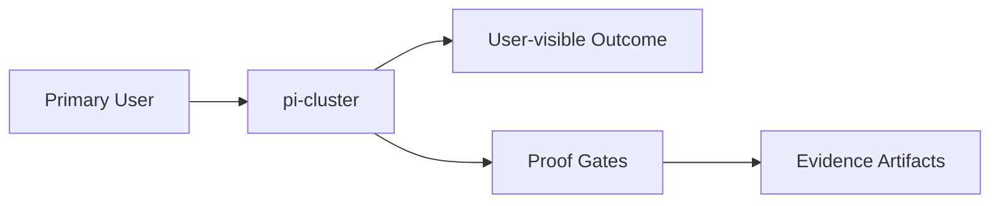

# Intent

## Product Outcome
- Create a production-grade, Git-managed repository for a heterogeneous edge Kubernetes cluster consisting of an intermittent x86_64 NixOS control plane (Cube) and four always-on ARM64 Raspberry Pi 3B+ worker nodes. The repository should define the cluster declaratively, preserve stable identity and recoverability, minimize resource usage, support long-running workloads that continue operating while the control plane is offline, and provide documented, reproducible infrastructure, networking, deployment, backup, validation, and operational procedures. The repository must contain only declarative configuration, automation, documentation, and encrypted secrets, while explicitly excluding live cluster state, credentials, certificates, databases, and other runtime artifacts.

## What This Project Is
pi-cluster is a not classified yet project built using Other.
Create a production-grade, Git-managed repository for a heterogeneous edge Kubernetes cluster consisting of an intermittent x86_64 NixOS control plane (Cube) and four always-on ARM64 Raspberry Pi 3B+ worker nodes. The repository should define the cluster declaratively, preserve stable identity and recoverability, minimize resource usage, support long-running workloads that continue operating while the control plane is offline, and provide documented, reproducible infrastructure, networking, deployment, backup, validation, and operational procedures. The repository must contain only declarative configuration, automation, documentation, and encrypted secrets, while explicitly excluding live cluster state, credentials, certificates, databases, and other runtime artifacts.

Key operating facts:
- **Primary languages**: Other
- **Detected surfaces**: not detected yet

## Product View

## Inferred Baseline
- Repository: pi-cluster
- Product type: not classified yet
- Primary languages: Other
- Detected surfaces: not detected yet

## Scope
| Area | In Scope | Proof Surface |
|---|---|---|
| Core workflow | Define a concrete user-visible workflow | Acceptance criteria + tests |
| Data contracts | Document canonical inputs/outputs | [INTERFACES.md](./INTERFACES.md) and schema checks |
| Delivery quality | Block promotion on broken proof surfaces | [VALIDATION.md](./VALIDATION.md) blocking gates |

## Non-Goals (Falsifiable)
| Non-goal | How to falsify |
|---|---|
| Feature creep beyond the primary outcome | Any PR adds capability not tied to outcome criteria |
| Shipping without evidence | Missing validation artifacts for promoted changes |
| Ambiguous ownership boundaries | Missing owner/system-of-record in interfaces |

## Constraints
- Technical: runtime, dependency, and topology boundaries are explicit.
- Operational: deployment, rollback, and incident ownership are defined.
- Security/compliance: sensitive data handling and authz are mandatory.

## Acceptance Criteria (must be objectively testable)
- [ ] Establish a reproducible, production-quality repository that declaratively defines and governs a heterogeneous Kubernetes edge cluster with an x86_64 NixOS control plane and four ARM64 Raspberry Pi worker nodes. The completed outcome is a version-controlled infrastructure project that can provision, validate, document, recover, and evolve the cluster while preserving stable cluster identity, supporting long-running edge workloads during intermittent control-plane availability, and providing a secure, maintainable foundation for future networking, service mesh, and application deployment.
- [ ] Non-functional targets are met (latency, reliability, cost, etc.).
- [ ] Validation gates pass and artifacts are attached.
- [ ] Repository test/lint/typecheck commands are defined and wired into CI.

## Epistemic Custody Fields

### Active Assumptions
- [ ] List any assumptions made to proceed.
- [ ] Flag assumptions that require future verification.

### Confidence & Risk Level
- **Confidence**: Low/Medium/High (Rationale: )
- **Risk**: Low/Medium/High (Impact of wrong assumptions: )

### Measured vs Inferred Facts
| Fact | Source (Provenance) | Type (Measured/Inferred) |
|---|---|---|
| | | |

### Unresolved Contradictions
- [ ] List any evidence that conflicts with current assumptions or intent.

### Deferred Questions
- [ ] Questions to be answered later.

### Stop Conditions
- [ ] Explicit conditions under which the agent should stop and ask for help.

### Proof Required Before Completion
- [ ] Specific evidence needed to prove the outcome is met.

## Tradeoffs Register
| Decision | Benefit | Cost | Review Trigger |
|---|---|---|---|
| Simplicity vs extensibility | Faster iteration | Potential rework | Feature set expands |
| Strict gates vs dev speed | Higher confidence | More upfront discipline | Lead time regressions |

## First Implementation Slice
- [ ] Define the smallest user-visible workflow to ship first.
- [ ] Define required data/contracts for that workflow.
- [ ] Define what is intentionally postponed until v2.

## Open Questions (with decision deadlines)
| Question | Owner | Deadline | Decision |
|---|---|---|---|
| Which interfaces are versioned at launch? | TBD | YYYY-MM-DD | |
| Which non-functional target is hardest to hit? | TBD | YYYY-MM-DD | |

<!-- decapod:codebase-attestation:start -->
## Codebase Attestation

- Repository signal fingerprint: `5d538758bb3ce9c1a509e978db6962e654afcfa45ec93361c1643881d890e2d0`
- Significant implementation surfaces: `.github/` (1 files), `README.md/` (1 files), `ingress/` (1 files), `kubernetes/` (1 files), `mesh/` (1 files), `networking/` (1 files), `nixos/` (1 files), `secrets/` (1 files)
- Refreshed from the current codebase by `decapod specs.refresh`
<!-- decapod:codebase-attestation:end -->
