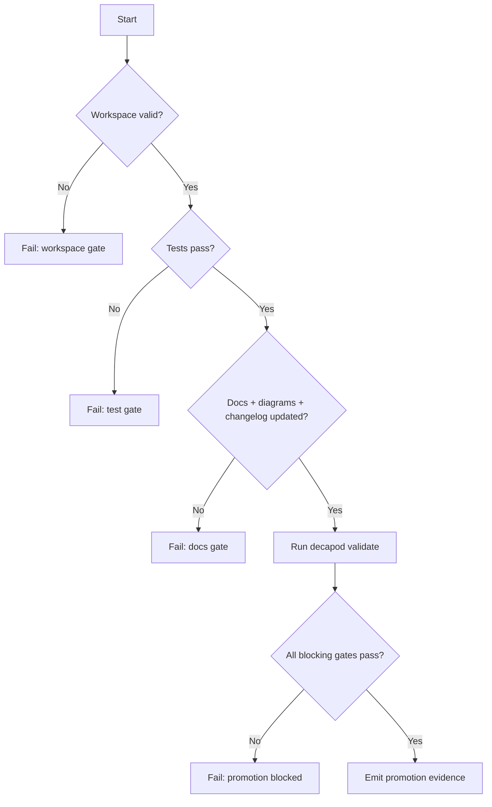

# Validation

## Validation Philosophy
> Validation is a release gate, not documentation theater.

## Validation Harness
Define the test and verification harness used by this project.
Key features:
- **Automated Tests**: Unit and integration test suites.
- **Linting & Formatting**: Static analysis tools and checkers.
- **CI/CD Integration**: Automatic execution of validation gates on push.

## Generated Spec Refresh Gates
Decapod must keep generated specs synchronized at governance pressure points. Fresh `decapod init` may scaffold a missing specs directory. After initialization, refresh must re-evaluate the existing codebase, preserve authored spec content, update codebase-derived attestations, and refresh the manifest rather than rendering scaffold replacements.

Refresh-capable paths:
- `decapod validate --refresh-specs`
- `decapod rpc --op specs.refresh`
- fresh initialization only: scaffold `.decapod/generated/specs/*.md` when the directory is absent

Refresh output requirements:
- Preserve all authored canonical spec content.
- Re-evaluate repo surfaces and update codebase-derived attestation blocks.
- Update `.decapod/generated/specs/.manifest.json` after writing files.
- Avoid adding parallel project-state or architecture-survey documents outside the canonical spec set.

## Validation Decision Tree

## Promotion Flow

## Proof Surfaces
- `decapod validate`
- Required test commands:
- Add repository-specific test command(s) here.
- Required integration/e2e commands:

## Promotion Gates

## Blocking Gates
| Gate | Command | Evidence |
|---|---|---|
| Architecture + interface drift check | `decapod validate` | Gate output |
| Tests pass | project test command | CI + local logs |
| Docs + changelog current | repo docs checks | PR diff |
| Security critical checks pass | security scanner suite | scanner reports |

## Warning Gates
| Gate | Trigger | Follow-up SLA |
|---|---|---|
| Coverage regression warning | Coverage drops below target | 48h |
| Non-blocking perf drift | P95 regression below hard threshold | 72h |

## Evidence Artifacts
| Artifact | Path | Required For |
|---|---|---|
| Validation report | `.decapod/generated/artifacts/provenance/*` | Promotion |
| Test logs | CI artifact store | Promotion |
| Architecture diagram snapshot | `ARCHITECTURE.md` | Promotion |
| Changelog entry | `CHANGELOG.md` | Promotion |

## Regression Guardrails
- Baseline references:
- Statistical thresholds (if non-deterministic):
- Rollback criteria:

## Bounded Execution
| Operation | Timeout | Failure Mode |
|---|---|---|
| Validation | 30s | timeout or lock |
| Unit test suite | project-defined | non-zero exit |
| Integration suite | project-defined | non-zero exit |

## Coverage Checklist
- [ ] Unit tests cover critical branches.
- [ ] Integration tests cover key user flows.
- [ ] Failure-path tests cover retries/timeouts.
- [ ] Docs/diagram/changelog updates included.

<!-- decapod:codebase-attestation:start -->
## Codebase Attestation

- Repository signal fingerprint: `2d4c400921310459314911c598f980e87136aa7aaf96e011d838ed0087eed7f4`
- Significant implementation surfaces: `.github/` (1 files), `README.md/` (1 files), `ingress/` (1 files), `kubernetes/` (1 files), `mesh/` (1 files), `networking/` (1 files), `nixos/` (1 files), `secrets/` (1 files)
- Refreshed from the current codebase by `decapod specs.refresh`
<!-- decapod:codebase-attestation:end -->
